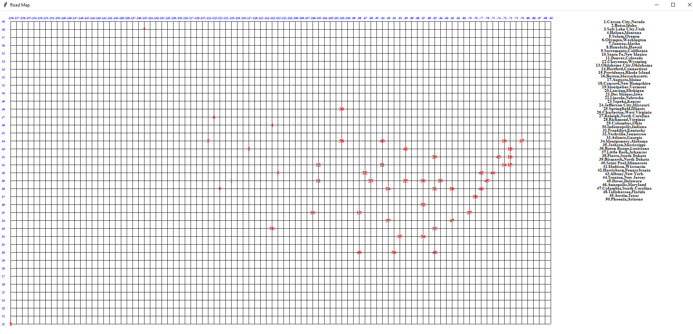
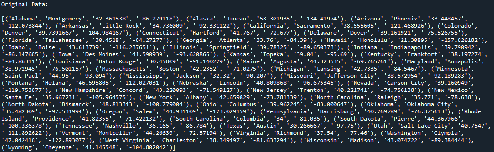
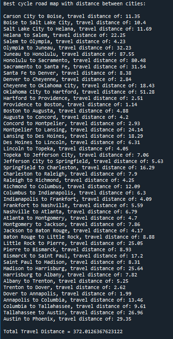

# Traveling Salesman

This is a simplified version of the travelling salesman problem with a brute force solution.

The file will take in a list of cities, along with their longitude and latitude, and calculates the shortest path to visiting all of the cities.
For this example the cities.txt file contains the USA state capitals.

The program uses random swapping and shifting while calculating euclidean distance to find the shortest path.
In the end tkinter GUI is used to display a grip map of all the cities and the order in which they should be traversed.

Total path distance is displayed in the console along with the original list and the ordered list with distance between each city displayed.

As the program uses random assignment, it will result in different paths and different total distances if run multiple times.

Please see the cities.py file for full code.
